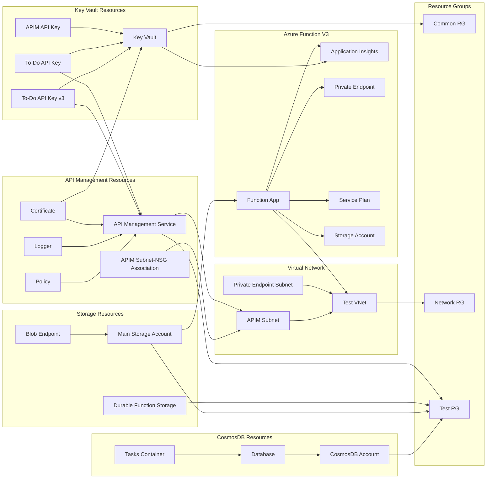
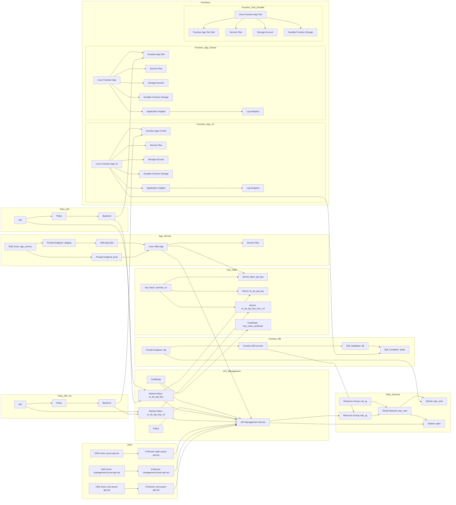

# DX Playground - Dev Environment

## Terraform Graph


## Inference Graph



## Ollama Graph

```mermaid
graph LR

subgraph API Management Services
    To Do API[To Do API]
    To Do API v3[To Do API v3]
end

subgraph Key Vault Secrets
    Certificate_KeyVault[Key Vault Certificate]
    Secret_KeyVault[Secret Key Vault]
end

subgraph Function Apps
    Function App[Function App]
    Azure_Function_v3[Azure Function v3]
end

subgraph Other Resources
    Service Bus[Service Bus]
    Redis Cache[Redis Cache]
    Storage Account[Storage Account]
    Application Insights[Application Insights]
    Log Analytics Workspace[Log Analytics Workspace]
end

To Do API --> Certificate_KeyVault
To Do API v3 --> Certificate_KeyVault

To Do API --> Service Bus
To Do API v3 --> Service Bus

To Do API --> Redis Cache
To Do API v3 --> Redis Cache

To Do API --> Storage Account
To Do API v3 --> Storage Account

Function App --> Certificate_KeyVault
Azure_Function_v3 --> Certificate_KeyVault

Function App --> Service Bus
Azure_Function_v3 --> Service Bus

Function App --> Redis Cache
Azure_Function_v3 --> Redis Cache

Function App --> Storage Account
Azure_Function_v3 --> Storage Account

Application Insights --> Certificate_KeyVault
Log Analytics Workspace --> Application Insights
```

## Script

```mermaid
graph LR
  Azurerm_subnetApim["azurerm_subnet.apim"]
  DataAzurerm_key_vault_secretTo_do_api_key_func_v3["data.azurerm_key_vault_secret.to_do_api_key_func_v3"]
  DataAzurerm_subscriptionCurrent["data.azurerm_subscription.current"]
  Azurerm_api_management_named_valueTo_do_api_key["azurerm_api_management_named_value.to_do_api_key"]
  DataAzurerm_key_vault_secretApim_api_key["data.azurerm_key_vault_secret.apim_api_key"]
  DataAzurerm_resource_groupTest_rg["data.azurerm_resource_group.test_rg"]
  DataAzurerm_key_vault_secretTo_do_api_key["data.azurerm_key_vault_secret.to_do_api_key"]
  Azurerm_api_management_named_valueTo_do_api_key_v3["azurerm_api_management_named_value.to_do_api_key_v3"]
  DataAzurerm_key_vaultCommon_kv["data.azurerm_key_vault.common_kv"]
  Dx_available_subnet_cidrFunction_v3_cidr["dx_available_subnet_cidr.function_v3_cidr"]
  DataAzurerm_resource_groupNet_rg["data.azurerm_resource_group.net_rg"]
  DataAzurerm_subnetPep_snet["data.azurerm_subnet.pep_snet"]
  Azurerm_cosmosdb_sql_databaseDb["azurerm_cosmosdb_sql_database.db"]
  DataAzurerm_resource_groupCommon_rg["data.azurerm_resource_group.common_rg"]
  DataAzurerm_virtual_networkTest_vnet["data.azurerm_virtual_network.test_vnet"]
  Azurerm_cosmosdb_sql_containerTasks["azurerm_cosmosdb_sql_container.tasks"]
  DataAzurerm_key_vaultCommon_kv --> DataAzurerm_resource_groupCommon_rg
  DataAzurerm_key_vault_secretApim_api_key --> DataAzurerm_key_vaultCommon_kv
  DataAzurerm_key_vault_secretTo_do_api_key --> DataAzurerm_key_vaultCommon_kv
  DataAzurerm_key_vault_secretTo_do_api_key_func_v3 --> DataAzurerm_key_vaultCommon_kv
  DataAzurerm_subnetPep_snet --> DataAzurerm_virtual_networkTest_vnet
  DataAzurerm_virtual_networkTest_vnet --> DataAzurerm_resource_groupNet_rg
  Azurerm_api_management_named_valueTo_do_api_key --> DataAzurerm_key_vault_secretTo_do_api_key
  Azurerm_api_management_named_valueTo_do_api_key --> ModuleApimAzurerm_api_managementThis
  Azurerm_api_management_named_valueTo_do_api_key_v3 --> DataAzurerm_key_vault_secretTo_do_api_key_func_v3
  Azurerm_api_management_named_valueTo_do_api_key_v3 --> ModuleApimAzurerm_api_managementThis
  Azurerm_cosmosdb_sql_containerTasks --> Azurerm_cosmosdb_sql_databaseDb
  Azurerm_cosmosdb_sql_databaseDb --> ModuleCosmosAzurerm_cosmosdb_accountThis
  Azurerm_subnetApim --> DataAzurerm_virtual_networkTest_vnet
  Dx_available_subnet_cidrFunction_v3_cidr --> DataAzurerm_virtual_networkTest_vnet
  ModuleApimDataAzurerm_private_dns_zoneAzure_api_net --> ModuleApimDataAzurerm_virtual_networkThis
  ModuleApimDataAzurerm_private_dns_zoneManagement_azure_api_net --> ModuleApimDataAzurerm_virtual_networkThis
  ModuleApimDataAzurerm_private_dns_zoneScm_azure_api_net --> ModuleApimDataAzurerm_virtual_networkThis
  ModuleApimDataAzurerm_virtual_networkThis --> DataAzurerm_virtual_networkTest_vnet
  ModuleApimAzurerm_api_managementThis --> DataAzurerm_resource_groupTest_rg
  ModuleApimAzurerm_api_managementThis --> Azurerm_subnetApim
  ModuleApimAzurerm_api_management_certificateThis --> ModuleApimDataAzurerm_key_vault_certificateKey_vault_certificate
  ModuleApimAzurerm_api_management_certificateThis --> ModuleApimAzurerm_api_managementThis
  ModuleApimAzurerm_api_management_diagnosticApplicationinsights --> ModuleApimAzurerm_api_management_loggerThis
  ModuleApimAzurerm_api_management_loggerThis --> ModuleApimAzurerm_api_managementThis
  ModuleApimAzurerm_api_management_loggerThis --> ModuleAzure_function_v3_application_insightsAzurerm_application_insightsMain
  ModuleApimAzurerm_api_management_policyThis --> ModuleApimAzurerm_api_managementThis
  ModuleApimAzurerm_management_lockThis --> ModuleApimAzurerm_api_managementThis
  ModuleApimAzurerm_monitor_autoscale_settingThis --> ModuleApimAzurerm_api_managementThis
  ModuleApimAzurerm_monitor_diagnostic_settingApim --> ModuleApimAzurerm_api_managementThis
  ModuleApimAzurerm_monitor_diagnostic_settingApim --> ModuleAzure_function_v3_application_insightsAzurerm_log_analytics_workspaceMain
  ModuleApimAzurerm_monitor_metric_alertThis --> ModuleApimAzurerm_api_managementThis
  ModuleApimAzurerm_network_security_groupNsg_apim --> ModuleApimDataAzurerm_virtual_networkThis
  ModuleApimAzurerm_private_dns_a_recordApim_azure_api_net --> ModuleApimDataAzurerm_private_dns_zoneAzure_api_net
  ModuleApimAzurerm_private_dns_a_recordApim_azure_api_net --> ModuleApimAzurerm_api_managementThis
  ModuleApimAzurerm_private_dns_a_recordApim_management_azure_api_net --> ModuleApimDataAzurerm_private_dns_zoneManagement_azure_api_net
  ModuleApimAzurerm_private_dns_a_recordApim_management_azure_api_net --> ModuleApimAzurerm_api_managementThis
  ModuleApimAzurerm_private_dns_a_recordApim_scm_azure_api_net --> ModuleApimDataAzurerm_private_dns_zoneScm_azure_api_net
  ModuleApimAzurerm_private_dns_a_recordApim_scm_azure_api_net --> ModuleApimAzurerm_api_managementThis
  ModuleApimAzurerm_subnet_network_security_group_associationSnet_nsg --> Azurerm_subnetApim
  ModuleApimAzurerm_subnet_network_security_group_associationSnet_nsg --> ModuleApimAzurerm_network_security_groupNsg_apim
  ModuleApim_rolesModuleApimAzurerm_role_assignmentThis --> DataAzurerm_subscriptionCurrent
  ModuleApim_rolesModuleApimAzurerm_role_assignmentThis --> ModuleApimAzurerm_api_managementThis
  ModuleApim_rolesModuleCosmosAzurerm_cosmosdb_sql_role_assignmentThis --> DataAzurerm_subscriptionCurrent
  ModuleApim_rolesModuleCosmosAzurerm_cosmosdb_sql_role_assignmentThis --> ModuleApimAzurerm_api_managementThis
  ModuleApim_rolesModuleEvent_hubAzurerm_role_assignmentThis --> DataAzurerm_subscriptionCurrent
  ModuleApim_rolesModuleEvent_hubAzurerm_role_assignmentThis --> ModuleApimAzurerm_api_managementThis
  ModuleApim_rolesModuleKey_vaultAzurerm_key_vault_access_policyThis --> DataAzurerm_key_vaultCommon_kv
  ModuleApim_rolesModuleKey_vaultAzurerm_key_vault_access_policyThis --> DataAzurerm_subscriptionCurrent
  ModuleApim_rolesModuleKey_vaultAzurerm_key_vault_access_policyThis --> ModuleApimAzurerm_api_managementThis
  ModuleApim_rolesModuleKey_vaultAzurerm_key_vault_access_policyThis --> ModuleApim_rolesModuleKey_vaultDataAzurerm_client_configCurrent
  ModuleApim_rolesModuleKey_vaultAzurerm_role_assignmentCertificates --> DataAzurerm_key_vaultCommon_kv
  ModuleApim_rolesModuleKey_vaultAzurerm_role_assignmentCertificates --> DataAzurerm_subscriptionCurrent
  ModuleApim_rolesModuleKey_vaultAzurerm_role_assignmentCertificates --> ModuleApimAzurerm_api_managementThis
  ModuleApim_rolesModuleKey_vaultAzurerm_role_assignmentKeys --> DataAzurerm_key_vaultCommon_kv
  ModuleApim_rolesModuleKey_vaultAzurerm_role_assignmentKeys --> DataAzurerm_subscriptionCurrent
  ModuleApim_rolesModuleKey_vaultAzurerm_role_assignmentKeys --> ModuleApimAzurerm_api_managementThis
  ModuleApim_rolesModuleKey_vaultAzurerm_role_assignmentSecrets --> DataAzurerm_key_vaultCommon_kv
  ModuleApim_rolesModuleKey_vaultAzurerm_role_assignmentSecrets --> DataAzurerm_subscriptionCurrent
  ModuleApim_rolesModuleKey_vaultAzurerm_role_assignmentSecrets --> ModuleApimAzurerm_api_managementThis
  ModuleApim_rolesModuleRedisAzurerm_redis_cache_access_policy_assignmentThis --> DataAzurerm_subscriptionCurrent
  ModuleApim_rolesModuleRedisAzurerm_redis_cache_access_policy_assignmentThis --> ModuleApimAzurerm_api_managementThis
  ModuleApim_rolesModuleService_busAzurerm_role_assignmentQueues --> DataAzurerm_subscriptionCurrent
  ModuleApim_rolesModuleService_busAzurerm_role_assignmentQueues --> ModuleApimAzurerm_api_managementThis
  ModuleApim_rolesModuleService_busAzurerm_role_assignmentSubscriptions --> DataAzurerm_subscriptionCurrent
  ModuleApim_rolesModuleService_busAzurerm_role_assignmentSubscriptions --> ModuleApimAzurerm_api_managementThis
  ModuleApim_rolesModuleService_busAzurerm_role_assignmentTopics --> DataAzurerm_subscriptionCurrent
  ModuleApim_rolesModuleService_busAzurerm_role_assignmentTopics --> ModuleApimAzurerm_api_managementThis
  ModuleApim_rolesModuleStorage_accountAzurerm_role_assignmentBlob --> DataAzurerm_subscriptionCurrent
  ModuleApim_rolesModuleStorage_accountAzurerm_role_assignmentBlob --> ModuleApimAzurerm_api_managementThis
  ModuleApim_rolesModuleStorage_accountAzurerm_role_assignmentQueue --> DataAzurerm_subscriptionCurrent
  ModuleApim_rolesModuleStorage_accountAzurerm_role_assignmentQueue --> ModuleApimAzurerm_api_managementThis
  ModuleApim_rolesModuleStorage_accountAzurerm_role_assignmentTable --> DataAzurerm_subscriptionCurrent
  ModuleApim_rolesModuleStorage_accountAzurerm_role_assignmentTable --> ModuleApimAzurerm_api_managementThis
  ModuleApp_serviceDataAzurerm_private_dns_zoneApp_service --> DataAzurerm_virtual_networkTest_vnet
  ModuleApp_serviceDataAzurerm_virtual_networkThis --> DataAzurerm_virtual_networkTest_vnet
  ModuleApp_serviceAzurerm_linux_web_appThis --> DataAzurerm_key_vault_secretApim_api_key
  ModuleApp_serviceAzurerm_linux_web_appThis --> ModuleApimAzurerm_api_managementThis
  ModuleApp_serviceAzurerm_linux_web_appThis --> ModuleApp_serviceAzurerm_service_planThis
  ModuleApp_serviceAzurerm_linux_web_appThis --> ModuleApp_serviceAzurerm_subnetThis
  ModuleApp_serviceAzurerm_linux_web_appThis --> ModuleAzure_function_v3_application_insightsAzurerm_key_vault_secretAi_connection_string
  ModuleApp_serviceAzurerm_linux_web_app_slotThis --> ModuleApp_serviceAzurerm_linux_web_appThis
  ModuleApp_serviceAzurerm_private_endpointApp_service_sites --> DataAzurerm_subnetPep_snet
  ModuleApp_serviceAzurerm_private_endpointApp_service_sites --> ModuleApp_serviceDataAzurerm_private_dns_zoneApp_service
  ModuleApp_serviceAzurerm_private_endpointApp_service_sites --> ModuleApp_serviceAzurerm_linux_web_appThis
  ModuleApp_serviceAzurerm_private_endpointStaging_app_service_sites --> DataAzurerm_subnetPep_snet
  ModuleApp_serviceAzurerm_private_endpointStaging_app_service_sites --> ModuleApp_serviceDataAzurerm_private_dns_zoneApp_service
  ModuleApp_serviceAzurerm_private_endpointStaging_app_service_sites --> ModuleApp_serviceAzurerm_linux_web_app_slotThis
  ModuleApp_serviceAzurerm_service_planThis --> DataAzurerm_resource_groupTest_rg
  ModuleApp_serviceAzurerm_subnetThis --> ModuleApp_serviceDataAzurerm_virtual_networkThis
  ModuleApp_service_rolesModuleApimAzurerm_role_assignmentThis --> DataAzurerm_subscriptionCurrent
  ModuleApp_service_rolesModuleApimAzurerm_role_assignmentThis --> ModuleApp_serviceAzurerm_private_endpointApp_service_sites
  ModuleApp_service_rolesModuleApimAzurerm_role_assignmentThis --> ModuleApp_serviceAzurerm_private_endpointStaging_app_service_sites
  ModuleApp_service_rolesModuleCosmosAzurerm_cosmosdb_sql_role_assignmentThis --> DataAzurerm_subscriptionCurrent
  ModuleApp_service_rolesModuleCosmosAzurerm_cosmosdb_sql_role_assignmentThis --> ModuleApp_serviceAzurerm_private_endpointApp_service_sites
  ModuleApp_service_rolesModuleCosmosAzurerm_cosmosdb_sql_role_assignmentThis --> ModuleApp_serviceAzurerm_private_endpointStaging_app_service_sites
  ModuleApp_service_rolesModuleEvent_hubAzurerm_role_assignmentThis --> DataAzurerm_subscriptionCurrent
  ModuleApp_service_rolesModuleEvent_hubAzurerm_role_assignmentThis --> ModuleApp_serviceAzurerm_private_endpointApp_service_sites
  ModuleApp_service_rolesModuleEvent_hubAzurerm_role_assignmentThis --> ModuleApp_serviceAzurerm_private_endpointStaging_app_service_sites
  ModuleApp_service_rolesModuleKey_vaultAzurerm_key_vault_access_policyThis --> DataAzurerm_subscriptionCurrent
  ModuleApp_service_rolesModuleKey_vaultAzurerm_key_vault_access_policyThis --> ModuleApp_serviceAzurerm_private_endpointApp_service_sites
  ModuleApp_service_rolesModuleKey_vaultAzurerm_key_vault_access_policyThis --> ModuleApp_serviceAzurerm_private_endpointStaging_app_service_sites
  ModuleApp_service_rolesModuleKey_vaultAzurerm_key_vault_access_policyThis --> ModuleApp_service_rolesModuleKey_vaultDataAzurerm_client_configCurrent
  ModuleApp_service_rolesModuleKey_vaultAzurerm_role_assignmentCertificates --> DataAzurerm_subscriptionCurrent
  ModuleApp_service_rolesModuleKey_vaultAzurerm_role_assignmentCertificates --> ModuleApp_serviceAzurerm_private_endpointApp_service_sites
  ModuleApp_service_rolesModuleKey_vaultAzurerm_role_assignmentCertificates --> ModuleApp_serviceAzurerm_private_endpointStaging_app_service_sites
  ModuleApp_service_rolesModuleKey_vaultAzurerm_role_assignmentKeys --> DataAzurerm_subscriptionCurrent
  ModuleApp_service_rolesModuleKey_vaultAzurerm_role_assignmentKeys --> ModuleApp_serviceAzurerm_private_endpointApp_service_sites
  ModuleApp_service_rolesModuleKey_vaultAzurerm_role_assignmentKeys --> ModuleApp_serviceAzurerm_private_endpointStaging_app_service_sites
  ModuleApp_service_rolesModuleKey_vaultAzurerm_role_assignmentSecrets --> DataAzurerm_subscriptionCurrent
  ModuleApp_service_rolesModuleKey_vaultAzurerm_role_assignmentSecrets --> ModuleApp_serviceAzurerm_private_endpointApp_service_sites
  ModuleApp_service_rolesModuleKey_vaultAzurerm_role_assignmentSecrets --> ModuleApp_serviceAzurerm_private_endpointStaging_app_service_sites
  ModuleApp_service_rolesModuleRedisAzurerm_redis_cache_access_policy_assignmentThis --> DataAzurerm_subscriptionCurrent
  ModuleApp_service_rolesModuleRedisAzurerm_redis_cache_access_policy_assignmentThis --> ModuleApp_serviceAzurerm_private_endpointApp_service_sites
  ModuleApp_service_rolesModuleRedisAzurerm_redis_cache_access_policy_assignmentThis --> ModuleApp_serviceAzurerm_private_endpointStaging_app_service_sites
  ModuleApp_service_rolesModuleService_busAzurerm_role_assignmentQueues --> DataAzurerm_subscriptionCurrent
  ModuleApp_service_rolesModuleService_busAzurerm_role_assignmentQueues --> ModuleApp_serviceAzurerm_private_endpointApp_service_sites
  ModuleApp_service_rolesModuleService_busAzurerm_role_assignmentQueues --> ModuleApp_serviceAzurerm_private_endpointStaging_app_service_sites
  ModuleApp_service_rolesModuleService_busAzurerm_role_assignmentSubscriptions --> DataAzurerm_subscriptionCurrent
  ModuleApp_service_rolesModuleService_busAzurerm_role_assignmentSubscriptions --> ModuleApp_serviceAzurerm_private_endpointApp_service_sites
  ModuleApp_service_rolesModuleService_busAzurerm_role_assignmentSubscriptions --> ModuleApp_serviceAzurerm_private_endpointStaging_app_service_sites
  ModuleApp_service_rolesModuleService_busAzurerm_role_assignmentTopics --> DataAzurerm_subscriptionCurrent
  ModuleApp_service_rolesModuleService_busAzurerm_role_assignmentTopics --> ModuleApp_serviceAzurerm_private_endpointApp_service_sites
  ModuleApp_service_rolesModuleService_busAzurerm_role_assignmentTopics --> ModuleApp_serviceAzurerm_private_endpointStaging_app_service_sites
  ModuleApp_service_rolesModuleStorage_accountAzurerm_role_assignmentBlob --> DataAzurerm_subscriptionCurrent
  ModuleApp_service_rolesModuleStorage_accountAzurerm_role_assignmentBlob --> ModuleApp_serviceAzurerm_private_endpointApp_service_sites
  ModuleApp_service_rolesModuleStorage_accountAzurerm_role_assignmentBlob --> ModuleApp_serviceAzurerm_private_endpointStaging_app_service_sites
  ModuleApp_service_rolesModuleStorage_accountAzurerm_role_assignmentQueue --> DataAzurerm_subscriptionCurrent
  ModuleApp_service_rolesModuleStorage_accountAzurerm_role_assignmentQueue --> ModuleApp_serviceAzurerm_private_endpointApp_service_sites
  ModuleApp_service_rolesModuleStorage_accountAzurerm_role_assignmentQueue --> ModuleApp_serviceAzurerm_private_endpointStaging_app_service_sites
  ModuleApp_service_rolesModuleStorage_accountAzurerm_role_assignmentTable --> DataAzurerm_subscriptionCurrent
  ModuleApp_service_rolesModuleStorage_accountAzurerm_role_assignmentTable --> ModuleApp_serviceAzurerm_private_endpointApp_service_sites
  ModuleApp_service_rolesModuleStorage_accountAzurerm_role_assignmentTable --> ModuleApp_serviceAzurerm_private_endpointStaging_app_service_sites
  ModuleAzure_function_v3_application_insightsAzurerm_application_insightsMain --> ModuleAzure_function_v3_application_insightsAzurerm_log_analytics_workspaceMain
  ModuleAzure_function_v3_application_insightsAzurerm_key_vault_secretAi_connection_string --> DataAzurerm_key_vaultCommon_kv
  ModuleAzure_function_v3_application_insightsAzurerm_key_vault_secretAi_connection_string --> ModuleAzure_function_v3_application_insightsAzurerm_application_insightsMain
  ModuleAzure_function_v3_application_insightsAzurerm_log_analytics_workspaceMain --> DataAzurerm_resource_groupTest_rg
  ModuleAzure_function_v3_function_appDataAzurerm_private_dns_zoneFunction_app --> DataAzurerm_virtual_networkTest_vnet
  ModuleAzure_function_v3_function_appDataAzurerm_private_dns_zoneStorage_account_blob --> DataAzurerm_virtual_networkTest_vnet
  ModuleAzure_function_v3_function_appDataAzurerm_private_dns_zoneStorage_account_file --> DataAzurerm_virtual_networkTest_vnet
  ModuleAzure_function_v3_function_appDataAzurerm_private_dns_zoneStorage_account_queue --> DataAzurerm_virtual_networkTest_vnet
  ModuleAzure_function_v3_function_appDataAzurerm_private_dns_zoneStorage_account_table --> DataAzurerm_virtual_networkTest_vnet
  ModuleAzure_function_v3_function_appDataAzurerm_virtual_networkThis --> DataAzurerm_virtual_networkTest_vnet
  ModuleAzure_function_v3_function_appAzurerm_linux_function_appThis --> Azurerm_cosmosdb_sql_containerTasks
  ModuleAzure_function_v3_function_appAzurerm_linux_function_appThis --> ModuleAzure_function_v3_application_insightsAzurerm_key_vault_secretAi_connection_string
  ModuleAzure_function_v3_function_appAzurerm_linux_function_appThis --> ModuleAzure_function_v3_function_appAzurerm_private_endpointSt_blob
  ModuleAzure_function_v3_function_appAzurerm_linux_function_appThis --> ModuleAzure_function_v3_function_appAzurerm_private_endpointSt_file
  ModuleAzure_function_v3_function_appAzurerm_linux_function_appThis --> ModuleAzure_function_v3_function_appAzurerm_private_endpointSt_queue
  ModuleAzure_function_v3_function_appAzurerm_linux_function_appThis --> ModuleAzure_function_v3_function_appAzurerm_service_planThis
  ModuleAzure_function_v3_function_appAzurerm_linux_function_appThis --> ModuleAzure_function_v3_function_appAzurerm_storage_accountDurable_function
  ModuleAzure_function_v3_function_appAzurerm_linux_function_appThis --> ModuleAzure_function_v3_function_appAzurerm_subnetThis
  ModuleAzure_function_v3_function_appAzurerm_linux_function_app_slotThis --> ModuleAzure_function_v3_function_appAzurerm_linux_function_appThis
  ModuleAzure_function_v3_function_appAzurerm_monitor_metric_alertFunction_app_health_check --> ModuleAzure_function_v3_function_appAzurerm_linux_function_appThis
  ModuleAzure_function_v3_function_appAzurerm_monitor_metric_alertStorage_account_health_check --> ModuleAzure_function_v3_function_appAzurerm_storage_accountThis
  ModuleAzure_function_v3_function_appAzurerm_private_endpointFunction_sites --> ModuleAzure_function_v3_function_appDataAzurerm_private_dns_zoneFunction_app
  ModuleAzure_function_v3_function_appAzurerm_private_endpointFunction_sites --> ModuleAzure_function_v3_function_appAzurerm_linux_function_appThis
  ModuleAzure_function_v3_function_appAzurerm_private_endpointSt_blob --> DataAzurerm_subnetPep_snet
  ModuleAzure_function_v3_function_appAzurerm_private_endpointSt_blob --> ModuleAzure_function_v3_function_appDataAzurerm_private_dns_zoneStorage_account_blob
  ModuleAzure_function_v3_function_appAzurerm_private_endpointSt_blob --> ModuleAzure_function_v3_function_appAzurerm_storage_accountThis
  ModuleAzure_function_v3_function_appAzurerm_private_endpointSt_file --> DataAzurerm_subnetPep_snet
  ModuleAzure_function_v3_function_appAzurerm_private_endpointSt_file --> ModuleAzure_function_v3_function_appDataAzurerm_private_dns_zoneStorage_account_file
  ModuleAzure_function_v3_function_appAzurerm_private_endpointSt_file --> ModuleAzure_function_v3_function_appAzurerm_storage_accountThis
  ModuleAzure_function_v3_function_appAzurerm_private_endpointSt_queue --> DataAzurerm_subnetPep_snet
  ModuleAzure_function_v3_function_appAzurerm_private_endpointSt_queue --> ModuleAzure_function_v3_function_appDataAzurerm_private_dns_zoneStorage_account_queue
  ModuleAzure_function_v3_function_appAzurerm_private_endpointSt_queue --> ModuleAzure_function_v3_function_appAzurerm_storage_accountThis
  ModuleAzure_function_v3_function_appAzurerm_private_endpointStaging_function_sites --> ModuleAzure_function_v3_function_appDataAzurerm_private_dns_zoneFunction_app
  ModuleAzure_function_v3_function_appAzurerm_private_endpointStaging_function_sites --> ModuleAzure_function_v3_function_appAzurerm_linux_function_app_slotThis
  ModuleAzure_function_v3_function_appAzurerm_private_endpointStd_blob --> DataAzurerm_subnetPep_snet
  ModuleAzure_function_v3_function_appAzurerm_private_endpointStd_blob --> ModuleAzure_function_v3_function_appDataAzurerm_private_dns_zoneStorage_account_blob
  ModuleAzure_function_v3_function_appAzurerm_private_endpointStd_blob --> ModuleAzure_function_v3_function_appAzurerm_storage_accountDurable_function
  ModuleAzure_function_v3_function_appAzurerm_private_endpointStd_file --> DataAzurerm_subnetPep_snet
  ModuleAzure_function_v3_function_appAzurerm_private_endpointStd_file --> ModuleAzure_function_v3_function_appDataAzurerm_private_dns_zoneStorage_account_file
  ModuleAzure_function_v3_function_appAzurerm_private_endpointStd_file --> ModuleAzure_function_v3_function_appAzurerm_storage_accountDurable_function
  ModuleAzure_function_v3_function_appAzurerm_private_endpointStd_queue --> DataAzurerm_subnetPep_snet
  ModuleAzure_function_v3_function_appAzurerm_private_endpointStd_queue --> ModuleAzure_function_v3_function_appDataAzurerm_private_dns_zoneStorage_account_queue
  ModuleAzure_function_v3_function_appAzurerm_private_endpointStd_queue --> ModuleAzure_function_v3_function_appAzurerm_storage_accountDurable_function
  ModuleAzure_function_v3_function_appAzurerm_private_endpointStd_table --> DataAzurerm_subnetPep_snet
  ModuleAzure_function_v3_function_appAzurerm_private_endpointStd_table --> ModuleAzure_function_v3_function_appDataAzurerm_private_dns_zoneStorage_account_table
  ModuleAzure_function_v3_function_appAzurerm_private_endpointStd_table --> ModuleAzure_function_v3_function_appAzurerm_storage_accountDurable_function
  ModuleAzure_function_v3_function_appAzurerm_role_assignmentDurable_function_storage_blob_data_contributor --> ModuleAzure_function_v3_function_appAzurerm_linux_function_appThis
  ModuleAzure_function_v3_function_appAzurerm_role_assignmentDurable_function_storage_queue_data_contributor --> ModuleAzure_function_v3_function_appAzurerm_linux_function_appThis
  ModuleAzure_function_v3_function_appAzurerm_role_assignmentDurable_function_storage_table_data_contributor --> ModuleAzure_function_v3_function_appAzurerm_linux_function_appThis
  ModuleAzure_function_v3_function_appAzurerm_role_assignmentFunction_storage_account_contributor --> ModuleAzure_function_v3_function_appAzurerm_linux_function_appThis
  ModuleAzure_function_v3_function_appAzurerm_role_assignmentFunction_storage_blob_data_owner --> ModuleAzure_function_v3_function_appAzurerm_linux_function_appThis
  ModuleAzure_function_v3_function_appAzurerm_role_assignmentFunction_storage_queue_data_contributor --> ModuleAzure_function_v3_function_appAzurerm_linux_function_appThis
  ModuleAzure_function_v3_function_appAzurerm_role_assignmentStaging_durable_function_storage_blob_data_contributor --> ModuleAzure_function_v3_function_appAzurerm_linux_function_app_slotThis
  ModuleAzure_function_v3_function_appAzurerm_role_assignmentStaging_durable_function_storage_queue_data_contributor --> ModuleAzure_function_v3_function_appAzurerm_linux_function_app_slotThis
  ModuleAzure_function_v3_function_appAzurerm_role_assignmentStaging_durable_function_storage_table_data_contributor --> ModuleAzure_function_v3_function_appAzurerm_linux_function_app_slotThis
  ModuleAzure_function_v3_function_appAzurerm_role_assignmentStaging_function_storage_account_contributor --> ModuleAzure_function_v3_function_appAzurerm_linux_function_app_slotThis
  ModuleAzure_function_v3_function_appAzurerm_role_assignmentStaging_function_storage_blob_data_owner --> ModuleAzure_function_v3_function_appAzurerm_linux_function_app_slotThis
  ModuleAzure_function_v3_function_appAzurerm_role_assignmentStaging_function_storage_queue_data_contributor --> ModuleAzure_function_v3_function_appAzurerm_linux_function_app_slotThis
  ModuleAzure_function_v3_function_appAzurerm_service_planThis --> DataAzurerm_resource_groupTest_rg
  ModuleAzure_function_v3_function_appAzurerm_storage_accountDurable_function --> DataAzurerm_resource_groupTest_rg
  ModuleAzure_function_v3_function_appAzurerm_storage_accountThis --> DataAzurerm_resource_groupTest_rg
  ModuleAzure_function_v3_function_appAzurerm_storage_account_network_rulesSt_network_rules --> ModuleAzure_function_v3_function_appAzurerm_linux_function_appThis
  ModuleAzure_function_v3_function_appAzurerm_storage_account_network_rulesStd_network_rules --> ModuleAzure_function_v3_function_appAzurerm_linux_function_appThis
  ModuleAzure_function_v3_function_appAzurerm_subnetThis --> Dx_available_subnet_cidrFunction_v3_cidr
  ModuleAzure_function_v3_function_appAzurerm_subnetThis --> ModuleAzure_function_v3_function_appDataAzurerm_virtual_networkThis
  ModuleCosmosDataAzurerm_private_dns_zoneCosmos --> DataAzurerm_resource_groupNet_rg
  ModuleCosmosAzurerm_cosmosdb_accountThis --> DataAzurerm_resource_groupTest_rg
  ModuleCosmosAzurerm_cosmosdb_sql_role_assignmentPrincipal_role_assignments --> ModuleCosmosAzurerm_cosmosdb_accountThis
  ModuleCosmosAzurerm_monitor_metric_alertCosmos_db_provisioned_throughput_exceeded --> ModuleCosmosAzurerm_cosmosdb_accountThis
  ModuleCosmosAzurerm_private_endpointSql --> DataAzurerm_subnetPep_snet
  ModuleCosmosAzurerm_private_endpointSql --> ModuleCosmosDataAzurerm_private_dns_zoneCosmos
  ModuleCosmosAzurerm_private_endpointSql --> ModuleCosmosAzurerm_cosmosdb_accountThis
  ModuleFunc_api_roleModuleApimAzurerm_role_assignmentThis --> DataAzurerm_subscriptionCurrent
  ModuleFunc_api_roleModuleApimAzurerm_role_assignmentThis --> ModuleFunction_appAzurerm_linux_function_app_slotThis
  ModuleFunc_api_roleModuleCosmosAzurerm_cosmosdb_sql_role_assignmentThis --> DataAzurerm_subscriptionCurrent
  ModuleFunc_api_roleModuleCosmosAzurerm_cosmosdb_sql_role_assignmentThis --> ModuleFunction_appAzurerm_linux_function_app_slotThis
  ModuleFunc_api_roleModuleEvent_hubAzurerm_role_assignmentThis --> DataAzurerm_subscriptionCurrent
  ModuleFunc_api_roleModuleEvent_hubAzurerm_role_assignmentThis --> ModuleFunction_appAzurerm_linux_function_app_slotThis
  ModuleFunc_api_roleModuleKey_vaultAzurerm_key_vault_access_policyThis --> DataAzurerm_subscriptionCurrent
  ModuleFunc_api_roleModuleKey_vaultAzurerm_key_vault_access_policyThis --> ModuleFunc_api_roleModuleKey_vaultDataAzurerm_client_configCurrent
  ModuleFunc_api_roleModuleKey_vaultAzurerm_key_vault_access_policyThis --> ModuleFunction_appAzurerm_linux_function_app_slotThis
  ModuleFunc_api_roleModuleKey_vaultAzurerm_role_assignmentCertificates --> DataAzurerm_subscriptionCurrent
  ModuleFunc_api_roleModuleKey_vaultAzurerm_role_assignmentCertificates --> ModuleFunction_appAzurerm_linux_function_app_slotThis
  ModuleFunc_api_roleModuleKey_vaultAzurerm_role_assignmentKeys --> DataAzurerm_subscriptionCurrent
  ModuleFunc_api_roleModuleKey_vaultAzurerm_role_assignmentKeys --> ModuleFunction_appAzurerm_linux_function_app_slotThis
  ModuleFunc_api_roleModuleKey_vaultAzurerm_role_assignmentSecrets --> DataAzurerm_subscriptionCurrent
  ModuleFunc_api_roleModuleKey_vaultAzurerm_role_assignmentSecrets --> ModuleFunction_appAzurerm_linux_function_app_slotThis
  ModuleFunc_api_roleModuleRedisAzurerm_redis_cache_access_policy_assignmentThis --> DataAzurerm_subscriptionCurrent
  ModuleFunc_api_roleModuleRedisAzurerm_redis_cache_access_policy_assignmentThis --> ModuleFunction_appAzurerm_linux_function_app_slotThis
  ModuleFunc_api_roleModuleService_busAzurerm_role_assignmentQueues --> DataAzurerm_subscriptionCurrent
  ModuleFunc_api_roleModuleService_busAzurerm_role_assignmentQueues --> ModuleFunction_appAzurerm_linux_function_app_slotThis
  ModuleFunc_api_roleModuleService_busAzurerm_role_assignmentSubscriptions --> DataAzurerm_subscriptionCurrent
  ModuleFunc_api_roleModuleService_busAzurerm_role_assignmentSubscriptions --> ModuleFunction_appAzurerm_linux_function_app_slotThis
  ModuleFunc_api_roleModuleService_busAzurerm_role_assignmentTopics --> DataAzurerm_subscriptionCurrent
  ModuleFunc_api_roleModuleService_busAzurerm_role_assignmentTopics --> ModuleFunction_appAzurerm_linux_function_app_slotThis
  ModuleFunc_api_roleModuleStorage_accountAzurerm_role_assignmentBlob --> DataAzurerm_subscriptionCurrent
  ModuleFunc_api_roleModuleStorage_accountAzurerm_role_assignmentBlob --> ModuleFunction_appAzurerm_linux_function_app_slotThis
  ModuleFunc_api_roleModuleStorage_accountAzurerm_role_assignmentQueue --> DataAzurerm_subscriptionCurrent
  ModuleFunc_api_roleModuleStorage_accountAzurerm_role_assignmentQueue --> ModuleFunction_appAzurerm_linux_function_app_slotThis
  ModuleFunc_api_roleModuleStorage_accountAzurerm_role_assignmentTable --> DataAzurerm_subscriptionCurrent
  ModuleFunc_api_roleModuleStorage_accountAzurerm_role_assignmentTable --> ModuleFunction_appAzurerm_linux_function_app_slotThis
  ModuleFunction_appDataAzurerm_private_dns_zoneFunction_app --> DataAzurerm_virtual_networkTest_vnet
  ModuleFunction_appDataAzurerm_private_dns_zoneStorage_account_blob --> DataAzurerm_virtual_networkTest_vnet
  ModuleFunction_appDataAzurerm_private_dns_zoneStorage_account_file --> DataAzurerm_virtual_networkTest_vnet
  ModuleFunction_appDataAzurerm_private_dns_zoneStorage_account_queue --> DataAzurerm_virtual_networkTest_vnet
  ModuleFunction_appDataAzurerm_private_dns_zoneStorage_account_table --> DataAzurerm_virtual_networkTest_vnet
  ModuleFunction_appDataAzurerm_virtual_networkThis --> DataAzurerm_virtual_networkTest_vnet
  ModuleFunction_appAzurerm_linux_function_appThis --> Azurerm_cosmosdb_sql_containerTasks
  ModuleFunction_appAzurerm_linux_function_appThis --> ModuleAzure_function_v3_application_insightsAzurerm_key_vault_secretAi_connection_string
  ModuleFunction_appAzurerm_linux_function_appThis --> ModuleFunction_appAzurerm_private_endpointSt_blob
  ModuleFunction_appAzurerm_linux_function_appThis --> ModuleFunction_appAzurerm_private_endpointSt_file
  ModuleFunction_appAzurerm_linux_function_appThis --> ModuleFunction_appAzurerm_private_endpointSt_queue
  ModuleFunction_appAzurerm_linux_function_appThis --> ModuleFunction_appAzurerm_service_planThis
  ModuleFunction_appAzurerm_linux_function_appThis --> ModuleFunction_appAzurerm_storage_accountDurable_function
  ModuleFunction_appAzurerm_linux_function_appThis --> ModuleFunction_appAzurerm_subnetThis
  ModuleFunction_appAzurerm_linux_function_app_slotThis --> ModuleFunction_appAzurerm_linux_function_appThis
  ModuleFunction_appAzurerm_monitor_metric_alertFunction_app_health_check --> ModuleFunction_appAzurerm_linux_function_appThis
  ModuleFunction_appAzurerm_monitor_metric_alertStorage_account_health_check --> ModuleFunction_appAzurerm_storage_accountThis
  ModuleFunction_appAzurerm_private_endpointFunction_sites --> ModuleFunction_appDataAzurerm_private_dns_zoneFunction_app
  ModuleFunction_appAzurerm_private_endpointFunction_sites --> ModuleFunction_appAzurerm_linux_function_appThis
  ModuleFunction_appAzurerm_private_endpointSt_blob --> DataAzurerm_subnetPep_snet
  ModuleFunction_appAzurerm_private_endpointSt_blob --> ModuleFunction_appDataAzurerm_private_dns_zoneStorage_account_blob
  ModuleFunction_appAzurerm_private_endpointSt_blob --> ModuleFunction_appAzurerm_storage_accountThis
  ModuleFunction_appAzurerm_private_endpointSt_file --> DataAzurerm_subnetPep_snet
  ModuleFunction_appAzurerm_private_endpointSt_file --> ModuleFunction_appDataAzurerm_private_dns_zoneStorage_account_file
  ModuleFunction_appAzurerm_private_endpointSt_file --> ModuleFunction_appAzurerm_storage_accountThis
  ModuleFunction_appAzurerm_private_endpointSt_queue --> DataAzurerm_subnetPep_snet
  ModuleFunction_appAzurerm_private_endpointSt_queue --> ModuleFunction_appDataAzurerm_private_dns_zoneStorage_account_queue
  ModuleFunction_appAzurerm_private_endpointSt_queue --> ModuleFunction_appAzurerm_storage_accountThis
  ModuleFunction_appAzurerm_private_endpointStaging_function_sites --> ModuleFunction_appDataAzurerm_private_dns_zoneFunction_app
  ModuleFunction_appAzurerm_private_endpointStaging_function_sites --> ModuleFunction_appAzurerm_linux_function_app_slotThis
  ModuleFunction_appAzurerm_private_endpointStd_blob --> DataAzurerm_subnetPep_snet
  ModuleFunction_appAzurerm_private_endpointStd_blob --> ModuleFunction_appDataAzurerm_private_dns_zoneStorage_account_blob
  ModuleFunction_appAzurerm_private_endpointStd_blob --> ModuleFunction_appAzurerm_storage_accountDurable_function
  ModuleFunction_appAzurerm_private_endpointStd_file --> DataAzurerm_subnetPep_snet
  ModuleFunction_appAzurerm_private_endpointStd_file --> ModuleFunction_appDataAzurerm_private_dns_zoneStorage_account_file
  ModuleFunction_appAzurerm_private_endpointStd_file --> ModuleFunction_appAzurerm_storage_accountDurable_function
  ModuleFunction_appAzurerm_private_endpointStd_queue --> DataAzurerm_subnetPep_snet
  ModuleFunction_appAzurerm_private_endpointStd_queue --> ModuleFunction_appDataAzurerm_private_dns_zoneStorage_account_queue
  ModuleFunction_appAzurerm_private_endpointStd_queue --> ModuleFunction_appAzurerm_storage_accountDurable_function
  ModuleFunction_appAzurerm_private_endpointStd_table --> DataAzurerm_subnetPep_snet
  ModuleFunction_appAzurerm_private_endpointStd_table --> ModuleFunction_appDataAzurerm_private_dns_zoneStorage_account_table
  ModuleFunction_appAzurerm_private_endpointStd_table --> ModuleFunction_appAzurerm_storage_accountDurable_function
  ModuleFunction_appAzurerm_role_assignmentDurable_function_storage_blob_data_contributor --> ModuleFunction_appAzurerm_linux_function_appThis
  ModuleFunction_appAzurerm_role_assignmentDurable_function_storage_queue_data_contributor --> ModuleFunction_appAzurerm_linux_function_appThis
  ModuleFunction_appAzurerm_role_assignmentDurable_function_storage_table_data_contributor --> ModuleFunction_appAzurerm_linux_function_appThis
  ModuleFunction_appAzurerm_role_assignmentFunction_storage_account_contributor --> ModuleFunction_appAzurerm_linux_function_appThis
  ModuleFunction_appAzurerm_role_assignmentFunction_storage_blob_data_owner --> ModuleFunction_appAzurerm_linux_function_appThis
  ModuleFunction_appAzurerm_role_assignmentFunction_storage_queue_data_contributor --> ModuleFunction_appAzurerm_linux_function_appThis
  ModuleFunction_appAzurerm_role_assignmentStaging_durable_function_storage_blob_data_contributor --> ModuleFunction_appAzurerm_linux_function_app_slotThis
  ModuleFunction_appAzurerm_role_assignmentStaging_durable_function_storage_queue_data_contributor --> ModuleFunction_appAzurerm_linux_function_app_slotThis
  ModuleFunction_appAzurerm_role_assignmentStaging_durable_function_storage_table_data_contributor --> ModuleFunction_appAzurerm_linux_function_app_slotThis
  ModuleFunction_appAzurerm_role_assignmentStaging_function_storage_account_contributor --> ModuleFunction_appAzurerm_linux_function_app_slotThis
  ModuleFunction_appAzurerm_role_assignmentStaging_function_storage_blob_data_owner --> ModuleFunction_appAzurerm_linux_function_app_slotThis
  ModuleFunction_appAzurerm_role_assignmentStaging_function_storage_queue_data_contributor --> ModuleFunction_appAzurerm_linux_function_app_slotThis
  ModuleFunction_appAzurerm_service_planThis --> DataAzurerm_resource_groupTest_rg
  ModuleFunction_appAzurerm_storage_accountDurable_function --> DataAzurerm_resource_groupTest_rg
  ModuleFunction_appAzurerm_storage_accountThis --> DataAzurerm_resource_groupTest_rg
  ModuleFunction_appAzurerm_storage_account_network_rulesSt_network_rules --> ModuleFunction_appAzurerm_linux_function_appThis
  ModuleFunction_appAzurerm_storage_account_network_rulesStd_network_rules --> ModuleFunction_appAzurerm_linux_function_appThis
  ModuleFunction_appAzurerm_subnetThis --> ModuleFunction_appDataAzurerm_virtual_networkThis
  ModuleFunction_test_durableDataAzurerm_private_dns_zoneFunction_app --> DataAzurerm_virtual_networkTest_vnet
  ModuleFunction_test_durableDataAzurerm_private_dns_zoneStorage_account_blob --> DataAzurerm_virtual_networkTest_vnet
  ModuleFunction_test_durableDataAzurerm_private_dns_zoneStorage_account_file --> DataAzurerm_virtual_networkTest_vnet
  ModuleFunction_test_durableDataAzurerm_private_dns_zoneStorage_account_queue --> DataAzurerm_virtual_networkTest_vnet
  ModuleFunction_test_durableDataAzurerm_private_dns_zoneStorage_account_table --> DataAzurerm_virtual_networkTest_vnet
  ModuleFunction_test_durableDataAzurerm_virtual_networkThis --> DataAzurerm_virtual_networkTest_vnet
  ModuleFunction_test_durableAzurerm_linux_function_appThis --> ModuleFunction_test_durableAzurerm_private_endpointSt_blob
  ModuleFunction_test_durableAzurerm_linux_function_appThis --> ModuleFunction_test_durableAzurerm_private_endpointSt_file
  ModuleFunction_test_durableAzurerm_linux_function_appThis --> ModuleFunction_test_durableAzurerm_private_endpointSt_queue
  ModuleFunction_test_durableAzurerm_linux_function_appThis --> ModuleFunction_test_durableAzurerm_service_planThis
  ModuleFunction_test_durableAzurerm_linux_function_appThis --> ModuleFunction_test_durableAzurerm_storage_accountDurable_function
  ModuleFunction_test_durableAzurerm_linux_function_appThis --> ModuleFunction_test_durableAzurerm_subnetThis
  ModuleFunction_test_durableAzurerm_linux_function_app_slotThis --> ModuleFunction_test_durableAzurerm_linux_function_appThis
  ModuleFunction_test_durableAzurerm_monitor_metric_alertFunction_app_health_check --> ModuleFunction_test_durableAzurerm_linux_function_appThis
  ModuleFunction_test_durableAzurerm_monitor_metric_alertStorage_account_health_check --> ModuleFunction_test_durableAzurerm_storage_accountThis
  ModuleFunction_test_durableAzurerm_private_endpointFunction_sites --> ModuleFunction_test_durableDataAzurerm_private_dns_zoneFunction_app
  ModuleFunction_test_durableAzurerm_private_endpointFunction_sites --> ModuleFunction_test_durableAzurerm_linux_function_appThis
  ModuleFunction_test_durableAzurerm_private_endpointSt_blob --> DataAzurerm_subnetPep_snet
  ModuleFunction_test_durableAzurerm_private_endpointSt_blob --> ModuleFunction_test_durableDataAzurerm_private_dns_zoneStorage_account_blob
  ModuleFunction_test_durableAzurerm_private_endpointSt_blob --> ModuleFunction_test_durableAzurerm_storage_accountThis
  ModuleFunction_test_durableAzurerm_private_endpointSt_file --> DataAzurerm_subnetPep_snet
  ModuleFunction_test_durableAzurerm_private_endpointSt_file --> ModuleFunction_test_durableDataAzurerm_private_dns_zoneStorage_account_file
  ModuleFunction_test_durableAzurerm_private_endpointSt_file --> ModuleFunction_test_durableAzurerm_storage_accountThis
  ModuleFunction_test_durableAzurerm_private_endpointSt_queue --> DataAzurerm_subnetPep_snet
  ModuleFunction_test_durableAzurerm_private_endpointSt_queue --> ModuleFunction_test_durableDataAzurerm_private_dns_zoneStorage_account_queue
  ModuleFunction_test_durableAzurerm_private_endpointSt_queue --> ModuleFunction_test_durableAzurerm_storage_accountThis
  ModuleFunction_test_durableAzurerm_private_endpointStaging_function_sites --> ModuleFunction_test_durableDataAzurerm_private_dns_zoneFunction_app
  ModuleFunction_test_durableAzurerm_private_endpointStaging_function_sites --> ModuleFunction_test_durableAzurerm_linux_function_app_slotThis
  ModuleFunction_test_durableAzurerm_private_endpointStd_blob --> DataAzurerm_subnetPep_snet
  ModuleFunction_test_durableAzurerm_private_endpointStd_blob --> ModuleFunction_test_durableDataAzurerm_private_dns_zoneStorage_account_blob
  ModuleFunction_test_durableAzurerm_private_endpointStd_blob --> ModuleFunction_test_durableAzurerm_storage_accountDurable_function
  ModuleFunction_test_durableAzurerm_private_endpointStd_file --> DataAzurerm_subnetPep_snet
  ModuleFunction_test_durableAzurerm_private_endpointStd_file --> ModuleFunction_test_durableDataAzurerm_private_dns_zoneStorage_account_file
  ModuleFunction_test_durableAzurerm_private_endpointStd_file --> ModuleFunction_test_durableAzurerm_storage_accountDurable_function
  ModuleFunction_test_durableAzurerm_private_endpointStd_queue --> DataAzurerm_subnetPep_snet
  ModuleFunction_test_durableAzurerm_private_endpointStd_queue --> ModuleFunction_test_durableDataAzurerm_private_dns_zoneStorage_account_queue
  ModuleFunction_test_durableAzurerm_private_endpointStd_queue --> ModuleFunction_test_durableAzurerm_storage_accountDurable_function
  ModuleFunction_test_durableAzurerm_private_endpointStd_table --> DataAzurerm_subnetPep_snet
  ModuleFunction_test_durableAzurerm_private_endpointStd_table --> ModuleFunction_test_durableDataAzurerm_private_dns_zoneStorage_account_table
  ModuleFunction_test_durableAzurerm_private_endpointStd_table --> ModuleFunction_test_durableAzurerm_storage_accountDurable_function
  ModuleFunction_test_durableAzurerm_role_assignmentDurable_function_storage_blob_data_contributor --> ModuleFunction_test_durableAzurerm_linux_function_appThis
  ModuleFunction_test_durableAzurerm_role_assignmentDurable_function_storage_queue_data_contributor --> ModuleFunction_test_durableAzurerm_linux_function_appThis
  ModuleFunction_test_durableAzurerm_role_assignmentDurable_function_storage_table_data_contributor --> ModuleFunction_test_durableAzurerm_linux_function_appThis
  ModuleFunction_test_durableAzurerm_role_assignmentFunction_storage_account_contributor --> ModuleFunction_test_durableAzurerm_linux_function_appThis
  ModuleFunction_test_durableAzurerm_role_assignmentFunction_storage_blob_data_owner --> ModuleFunction_test_durableAzurerm_linux_function_appThis
  ModuleFunction_test_durableAzurerm_role_assignmentFunction_storage_queue_data_contributor --> ModuleFunction_test_durableAzurerm_linux_function_appThis
  ModuleFunction_test_durableAzurerm_role_assignmentStaging_durable_function_storage_blob_data_contributor --> ModuleFunction_test_durableAzurerm_linux_function_app_slotThis
  ModuleFunction_test_durableAzurerm_role_assignmentStaging_durable_function_storage_queue_data_contributor --> ModuleFunction_test_durableAzurerm_linux_function_app_slotThis
  ModuleFunction_test_durableAzurerm_role_assignmentStaging_durable_function_storage_table_data_contributor --> ModuleFunction_test_durableAzurerm_linux_function_app_slotThis
  ModuleFunction_test_durableAzurerm_role_assignmentStaging_function_storage_account_contributor --> ModuleFunction_test_durableAzurerm_linux_function_app_slotThis
  ModuleFunction_test_durableAzurerm_role_assignmentStaging_function_storage_blob_data_owner --> ModuleFunction_test_durableAzurerm_linux_function_app_slotThis
  ModuleFunction_test_durableAzurerm_role_assignmentStaging_function_storage_queue_data_contributor --> ModuleFunction_test_durableAzurerm_linux_function_app_slotThis
  ModuleFunction_test_durableAzurerm_service_planThis --> DataAzurerm_resource_groupTest_rg
  ModuleFunction_test_durableAzurerm_storage_accountDurable_function --> DataAzurerm_resource_groupTest_rg
  ModuleFunction_test_durableAzurerm_storage_accountThis --> DataAzurerm_resource_groupTest_rg
  ModuleFunction_test_durableAzurerm_storage_account_network_rulesSt_network_rules --> ModuleFunction_test_durableAzurerm_linux_function_appThis
  ModuleFunction_test_durableAzurerm_storage_account_network_rulesStd_network_rules --> ModuleFunction_test_durableAzurerm_linux_function_appThis
  ModuleFunction_test_durableAzurerm_subnetThis --> ModuleFunction_test_durableDataAzurerm_virtual_networkThis
  ModuleFunction_v3_api_roleModuleApimAzurerm_role_assignmentThis --> DataAzurerm_subscriptionCurrent
  ModuleFunction_v3_api_roleModuleApimAzurerm_role_assignmentThis --> ModuleAzure_function_v3_function_appAzurerm_linux_function_app_slotThis
  ModuleFunction_v3_api_roleModuleCosmosAzurerm_cosmosdb_sql_role_assignmentThis --> DataAzurerm_subscriptionCurrent
  ModuleFunction_v3_api_roleModuleCosmosAzurerm_cosmosdb_sql_role_assignmentThis --> ModuleAzure_function_v3_function_appAzurerm_linux_function_app_slotThis
  ModuleFunction_v3_api_roleModuleEvent_hubAzurerm_role_assignmentThis --> DataAzurerm_subscriptionCurrent
  ModuleFunction_v3_api_roleModuleEvent_hubAzurerm_role_assignmentThis --> ModuleAzure_function_v3_function_appAzurerm_linux_function_app_slotThis
  ModuleFunction_v3_api_roleModuleKey_vaultAzurerm_key_vault_access_policyThis --> DataAzurerm_subscriptionCurrent
  ModuleFunction_v3_api_roleModuleKey_vaultAzurerm_key_vault_access_policyThis --> ModuleAzure_function_v3_function_appAzurerm_linux_function_app_slotThis
  ModuleFunction_v3_api_roleModuleKey_vaultAzurerm_key_vault_access_policyThis --> ModuleFunction_v3_api_roleModuleKey_vaultDataAzurerm_client_configCurrent
  ModuleFunction_v3_api_roleModuleKey_vaultAzurerm_role_assignmentCertificates --> DataAzurerm_subscriptionCurrent
  ModuleFunction_v3_api_roleModuleKey_vaultAzurerm_role_assignmentCertificates --> ModuleAzure_function_v3_function_appAzurerm_linux_function_app_slotThis
  ModuleFunction_v3_api_roleModuleKey_vaultAzurerm_role_assignmentKeys --> DataAzurerm_subscriptionCurrent
  ModuleFunction_v3_api_roleModuleKey_vaultAzurerm_role_assignmentKeys --> ModuleAzure_function_v3_function_appAzurerm_linux_function_app_slotThis
  ModuleFunction_v3_api_roleModuleKey_vaultAzurerm_role_assignmentSecrets --> DataAzurerm_subscriptionCurrent
  ModuleFunction_v3_api_roleModuleKey_vaultAzurerm_role_assignmentSecrets --> ModuleAzure_function_v3_function_appAzurerm_linux_function_app_slotThis
  ModuleFunction_v3_api_roleModuleRedisAzurerm_redis_cache_access_policy_assignmentThis --> DataAzurerm_subscriptionCurrent
  ModuleFunction_v3_api_roleModuleRedisAzurerm_redis_cache_access_policy_assignmentThis --> ModuleAzure_function_v3_function_appAzurerm_linux_function_app_slotThis
  ModuleFunction_v3_api_roleModuleService_busAzurerm_role_assignmentQueues --> DataAzurerm_subscriptionCurrent
  ModuleFunction_v3_api_roleModuleService_busAzurerm_role_assignmentQueues --> ModuleAzure_function_v3_function_appAzurerm_linux_function_app_slotThis
  ModuleFunction_v3_api_roleModuleService_busAzurerm_role_assignmentSubscriptions --> DataAzurerm_subscriptionCurrent
  ModuleFunction_v3_api_roleModuleService_busAzurerm_role_assignmentSubscriptions --> ModuleAzure_function_v3_function_appAzurerm_linux_function_app_slotThis
  ModuleFunction_v3_api_roleModuleService_busAzurerm_role_assignmentTopics --> DataAzurerm_subscriptionCurrent
  ModuleFunction_v3_api_roleModuleService_busAzurerm_role_assignmentTopics --> ModuleAzure_function_v3_function_appAzurerm_linux_function_app_slotThis
  ModuleFunction_v3_api_roleModuleStorage_accountAzurerm_role_assignmentBlob --> DataAzurerm_subscriptionCurrent
  ModuleFunction_v3_api_roleModuleStorage_accountAzurerm_role_assignmentBlob --> ModuleAzure_function_v3_function_appAzurerm_linux_function_app_slotThis
  ModuleFunction_v3_api_roleModuleStorage_accountAzurerm_role_assignmentQueue --> DataAzurerm_subscriptionCurrent
  ModuleFunction_v3_api_roleModuleStorage_accountAzurerm_role_assignmentQueue --> ModuleAzure_function_v3_function_appAzurerm_linux_function_app_slotThis
  ModuleFunction_v3_api_roleModuleStorage_accountAzurerm_role_assignmentTable --> DataAzurerm_subscriptionCurrent
  ModuleFunction_v3_api_roleModuleStorage_accountAzurerm_role_assignmentTable --> ModuleAzure_function_v3_function_appAzurerm_linux_function_app_slotThis
  ModuleTo_do_apiAzurerm_api_management_apiApi --> Azurerm_api_management_named_valueTo_do_api_key
  ModuleTo_do_apiAzurerm_api_management_api_policyPolicy --> ModuleTo_do_apiAzurerm_api_management_apiApi
  ModuleTo_do_apiAzurerm_api_management_api_policyPolicy --> ModuleTo_do_apiAzurerm_api_management_backendBackend
  ModuleTo_do_apiAzurerm_api_management_backendBackend --> Azurerm_api_management_named_valueTo_do_api_key
  ModuleTo_do_apiAzurerm_api_management_backendBackend --> ModuleFunction_appAzurerm_linux_function_app_slotThis
  ModuleTo_do_api_application_insightsAzurerm_application_insightsMain --> ModuleTo_do_api_application_insightsAzurerm_log_analytics_workspaceMain
  ModuleTo_do_api_application_insightsAzurerm_key_vault_secretAi_connection_string --> DataAzurerm_key_vaultCommon_kv
  ModuleTo_do_api_application_insightsAzurerm_key_vault_secretAi_connection_string --> ModuleTo_do_api_application_insightsAzurerm_application_insightsMain
  ModuleTo_do_api_application_insightsAzurerm_log_analytics_workspaceMain --> DataAzurerm_resource_groupTest_rg
  ModuleTo_do_api_v3Azurerm_api_management_apiApi --> Azurerm_api_management_named_valueTo_do_api_key_v3
  ModuleTo_do_api_v3Azurerm_api_management_api_policyPolicy --> ModuleTo_do_api_v3Azurerm_api_management_apiApi
  ModuleTo_do_api_v3Azurerm_api_management_api_policyPolicy --> ModuleTo_do_api_v3Azurerm_api_management_backendBackend
  ModuleTo_do_api_v3Azurerm_api_management_backendBackend --> Azurerm_api_management_named_valueTo_do_api_key_v3
  ModuleTo_do_api_v3Azurerm_api_management_backendBackend --> ModuleAzure_function_v3_function_appAzurerm_linux_function_app_slotThis
```

## AI Foundry o4-mini


<!-- BEGIN_TF_DOCS -->
## Requirements

| Name | Version |
|------|---------|
| <a name="requirement_azurerm"></a> [azurerm](#requirement\_azurerm) | ~> 4.1 |
| <a name="requirement_dx"></a> [dx](#requirement\_dx) | ~> 0 |

## Providers

| Name | Version |
|------|---------|
| <a name="provider_azurerm"></a> [azurerm](#provider\_azurerm) | 4.28.0 |
| <a name="provider_dx"></a> [dx](#provider\_dx) | ~> 0 |

## Modules

| Name | Source | Version |
|------|--------|---------|
| <a name="module_apim"></a> [apim](#module\_apim) | pagopa-dx/azure-api-management/azurerm | ~> 1 |
| <a name="module_apim_roles"></a> [apim\_roles](#module\_apim\_roles) | pagopa-dx/azure-role-assignments/azurerm | ~> 1 |
| <a name="module_app_service"></a> [app\_service](#module\_app\_service) | pagopa-dx/azure-app-service/azurerm | ~> 0 |
| <a name="module_app_service_roles"></a> [app\_service\_roles](#module\_app\_service\_roles) | pagopa-dx/azure-role-assignments/azurerm | ~> 1 |
| <a name="module_azure_function_v3_application_insights"></a> [azure\_function\_v3\_application\_insights](#module\_azure\_function\_v3\_application\_insights) | ../_modules/application_insights | n/a |
| <a name="module_azure_function_v3_function_app"></a> [azure\_function\_v3\_function\_app](#module\_azure\_function\_v3\_function\_app) | pagopa-dx/azure-function-app/azurerm | ~> 0 |
| <a name="module_cosmos"></a> [cosmos](#module\_cosmos) | pagopa-dx/azure-cosmos-account/azurerm | ~> 0 |
| <a name="module_func_api_role"></a> [func\_api\_role](#module\_func\_api\_role) | pagopa-dx/azure-role-assignments/azurerm | ~> 1 |
| <a name="module_function_app"></a> [function\_app](#module\_function\_app) | pagopa-dx/azure-function-app/azurerm | ~> 0 |
| <a name="module_function_test_durable"></a> [function\_test\_durable](#module\_function\_test\_durable) | pagopa-dx/azure-function-app/azurerm | ~> 0.2 |
| <a name="module_function_v3_api_role"></a> [function\_v3\_api\_role](#module\_function\_v3\_api\_role) | pagopa-dx/azure-role-assignments/azurerm | ~> 1 |
| <a name="module_naming_convention"></a> [naming\_convention](#module\_naming\_convention) | pagopa-dx/azure-naming-convention/azurerm | ~> 0.0 |
| <a name="module_to_do_api"></a> [to\_do\_api](#module\_to\_do\_api) | ../_modules/api | n/a |
| <a name="module_to_do_api_application_insights"></a> [to\_do\_api\_application\_insights](#module\_to\_do\_api\_application\_insights) | ../_modules/application_insights | n/a |
| <a name="module_to_do_api_v3"></a> [to\_do\_api\_v3](#module\_to\_do\_api\_v3) | ../_modules/api | n/a |

## Resources

| Name | Type |
|------|------|
| [azurerm_api_management_named_value.to_do_api_key](https://registry.terraform.io/providers/hashicorp/azurerm/latest/docs/resources/api_management_named_value) | resource |
| [azurerm_api_management_named_value.to_do_api_key_v3](https://registry.terraform.io/providers/hashicorp/azurerm/latest/docs/resources/api_management_named_value) | resource |
| [azurerm_cosmosdb_sql_container.tasks](https://registry.terraform.io/providers/hashicorp/azurerm/latest/docs/resources/cosmosdb_sql_container) | resource |
| [azurerm_cosmosdb_sql_database.db](https://registry.terraform.io/providers/hashicorp/azurerm/latest/docs/resources/cosmosdb_sql_database) | resource |
| [azurerm_subnet.apim](https://registry.terraform.io/providers/hashicorp/azurerm/latest/docs/resources/subnet) | resource |
| [dx_available_subnet_cidr.function_v3_cidr](https://registry.terraform.io/providers/pagopa-dx/azure/latest/docs/resources/available_subnet_cidr) | resource |
| [azurerm_key_vault.common_kv](https://registry.terraform.io/providers/hashicorp/azurerm/latest/docs/data-sources/key_vault) | data source |
| [azurerm_key_vault_secret.apim_api_key](https://registry.terraform.io/providers/hashicorp/azurerm/latest/docs/data-sources/key_vault_secret) | data source |
| [azurerm_key_vault_secret.to_do_api_key](https://registry.terraform.io/providers/hashicorp/azurerm/latest/docs/data-sources/key_vault_secret) | data source |
| [azurerm_key_vault_secret.to_do_api_key_func_v3](https://registry.terraform.io/providers/hashicorp/azurerm/latest/docs/data-sources/key_vault_secret) | data source |
| [azurerm_resource_group.common_rg](https://registry.terraform.io/providers/hashicorp/azurerm/latest/docs/data-sources/resource_group) | data source |
| [azurerm_resource_group.net_rg](https://registry.terraform.io/providers/hashicorp/azurerm/latest/docs/data-sources/resource_group) | data source |
| [azurerm_resource_group.test_rg](https://registry.terraform.io/providers/hashicorp/azurerm/latest/docs/data-sources/resource_group) | data source |
| [azurerm_subnet.pep_snet](https://registry.terraform.io/providers/hashicorp/azurerm/latest/docs/data-sources/subnet) | data source |
| [azurerm_subscription.current](https://registry.terraform.io/providers/hashicorp/azurerm/latest/docs/data-sources/subscription) | data source |
| [azurerm_virtual_network.test_vnet](https://registry.terraform.io/providers/hashicorp/azurerm/latest/docs/data-sources/virtual_network) | data source |

## Inputs

No inputs.

## Outputs

No outputs.
<!-- END_TF_DOCS -->
