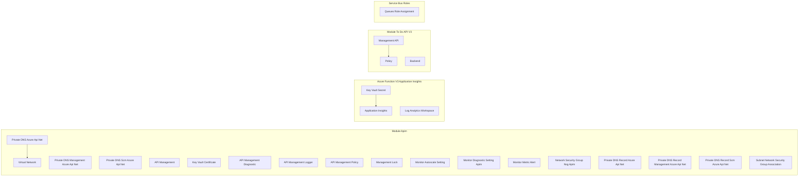

# DX Playground - Dev Environment

## Terraform Graph

## Inference Graph

## Ollama Graph

<!-- BEGIN_TF_DOCS -->
## Requirements

| Name | Version |
|------|---------|
|  [azurerm](#requirement\_azurerm) | ~> 4.1 |
|  [dx](#requirement\_dx) | ~> 0 |

## Providers

| Name | Version |
|------|---------|
|  [azurerm](#provider\_azurerm) | 4.28.0 |
|  [dx](#provider\_dx) | ~> 0 |

## Modules

| Name | Source | Version |
|------|--------|---------|
|  [apim](#module\_apim) | pagopa-dx/azure-api-management/azurerm | ~> 1 |
|  [apim\_roles](#module\_apim\_roles) | pagopa-dx/azure-role-assignments/azurerm | ~> 1 |
|  [app\_service](#module\_app\_service) | pagopa-dx/azure-app-service/azurerm | ~> 0 |
|  [app\_service\_roles](#module\_app\_service\_roles) | pagopa-dx/azure-role-assignments/azurerm | ~> 1 |
|  [azure\_function\_v3\_application\_insights](#module\_azure\_function\_v3\_application\_insights) | ../_modules/application_insights | n/a |
|  [azure\_function\_v3\_function\_app](#module\_azure\_function\_v3\_function\_app) | pagopa-dx/azure-function-app/azurerm | ~> 0 |
|  [cosmos](#module\_cosmos) | pagopa-dx/azure-cosmos-account/azurerm | ~> 0 |
|  [func\_api\_role](#module\_func\_api\_role) | pagopa-dx/azure-role-assignments/azurerm | ~> 1 |
|  [function\_app](#module\_function\_app) | pagopa-dx/azure-function-app/azurerm | ~> 0 |
|  [function\_test\_durable](#module\_function\_test\_durable) | pagopa-dx/azure-function-app/azurerm | ~> 0.2 |
|  [function\_v3\_api\_role](#module\_function\_v3\_api\_role) | pagopa-dx/azure-role-assignments/azurerm | ~> 1 |
|  [naming\_convention](#module\_naming\_convention) | pagopa-dx/azure-naming-convention/azurerm | ~> 0.0 |
|  [to\_do\_api](#module\_to\_do\_api) | ../_modules/api | n/a |
|  [to\_do\_api\_application\_insights](#module\_to\_do\_api\_application\_insights) | ../_modules/application_insights | n/a |
|  [to\_do\_api\_v3](#module\_to\_do\_api\_v3) | ../_modules/api | n/a |

## Resources

| Name | Type |
|------|------|
| [azurerm_api_management_named_value.to_do_api_key](https://registry.terraform.io/providers/hashicorp/azurerm/latest/docs/resources/api_management_named_value) | resource |
| [azurerm_api_management_named_value.to_do_api_key_v3](https://registry.terraform.io/providers/hashicorp/azurerm/latest/docs/resources/api_management_named_value) | resource |
| [azurerm_cosmosdb_sql_container.tasks](https://registry.terraform.io/providers/hashicorp/azurerm/latest/docs/resources/cosmosdb_sql_container) | resource |
| [azurerm_cosmosdb_sql_database.db](https://registry.terraform.io/providers/hashicorp/azurerm/latest/docs/resources/cosmosdb_sql_database) | resource |
| [azurerm_subnet.apim](https://registry.terraform.io/providers/hashicorp/azurerm/latest/docs/resources/subnet) | resource |
| [dx_available_subnet_cidr.function_v3_cidr](https://registry.terraform.io/providers/pagopa-dx/azure/latest/docs/resources/available_subnet_cidr) | resource |
| [azurerm_key_vault.common_kv](https://registry.terraform.io/providers/hashicorp/azurerm/latest/docs/data-sources/key_vault) | data source |
| [azurerm_key_vault_secret.apim_api_key](https://registry.terraform.io/providers/hashicorp/azurerm/latest/docs/data-sources/key_vault_secret) | data source |
| [azurerm_key_vault_secret.to_do_api_key](https://registry.terraform.io/providers/hashicorp/azurerm/latest/docs/data-sources/key_vault_secret) | data source |
| [azurerm_key_vault_secret.to_do_api_key_func_v3](https://registry.terraform.io/providers/hashicorp/azurerm/latest/docs/data-sources/key_vault_secret) | data source |
| [azurerm_resource_group.common_rg](https://registry.terraform.io/providers/hashicorp/azurerm/latest/docs/data-sources/resource_group) | data source |
| [azurerm_resource_group.net_rg](https://registry.terraform.io/providers/hashicorp/azurerm/latest/docs/data-sources/resource_group) | data source |
| [azurerm_resource_group.test_rg](https://registry.terraform.io/providers/hashicorp/azurerm/latest/docs/data-sources/resource_group) | data source |
| [azurerm_subnet.pep_snet](https://registry.terraform.io/providers/hashicorp/azurerm/latest/docs/data-sources/subnet) | data source |
| [azurerm_subscription.current](https://registry.terraform.io/providers/hashicorp/azurerm/latest/docs/data-sources/subscription) | data source |
| [azurerm_virtual_network.test_vnet](https://registry.terraform.io/providers/hashicorp/azurerm/latest/docs/data-sources/virtual_network) | data source |

## Inputs

No inputs.

## Outputs

No outputs.
<!-- END_TF_DOCS -->
