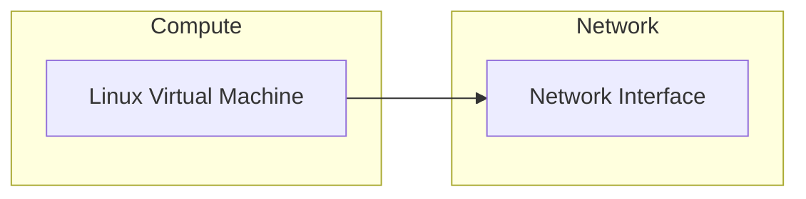
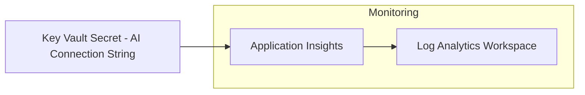
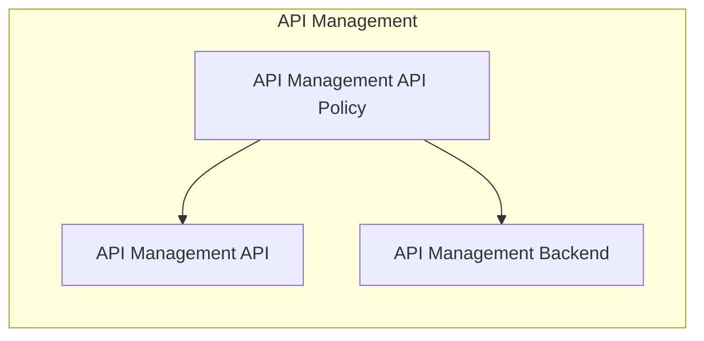

# All modules graphs, result of Azure AI complete workload

```mermaid
graph LR
  subgraph Compute
    VM["Linux Virtual Machine"]
  end
  subgraph Network
    NIC["Network Interface"]
  end
  VM --> NIC
```

```mermaid
graph LR
  subgraph Monitoring
    ApplicationInsights["Application Insights"]
    LogAnalyticsWorkspace["Log Analytics Workspace"]
  end

  KeyVaultSecretAIConnectionString["Key Vault Secret - AI Connection String"]

  KeyVaultSecretAIConnectionString --> ApplicationInsights
  ApplicationInsights --> LogAnalyticsWorkspace
```

```mermaid
graph LR
  subgraph API Management
    Policy["API Management API Policy"]
    API["API Management API"]
    Backend["API Management Backend"]
  end

  Policy --> API
  Policy --> Backend
```
