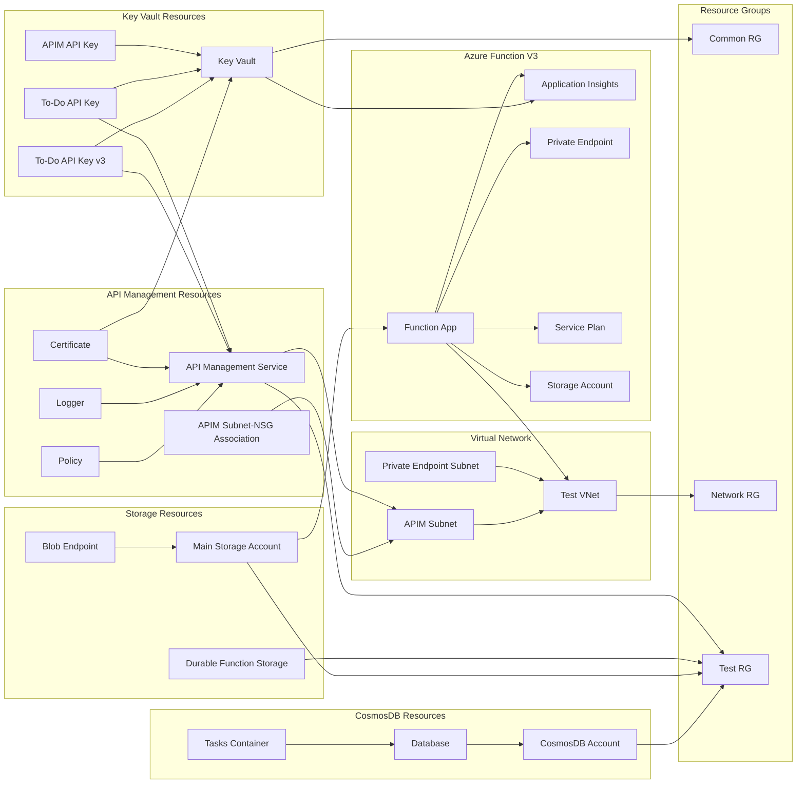

```mermaid
graph LR
  subgraph KeyVault["Key Vault Resources"]
    KV_Common["Key Vault"]
    Secret_APIM["APIM API Key"]
    Secret_ToDo["To-Do API Key"]
    Secret_ToDoV3["To-Do API Key v3"]
  end

  subgraph ResourceGroups["Resource Groups"]
    RG_Common["Common RG"]
    RG_Network["Network RG"]
    RG_Test["Test RG"]
  end

  subgraph VirtualNetwork["Virtual Network"]
    Test_VNet["Test VNet"]
    Subnet_APIM["APIM Subnet"]
    Subnet_PEP["Private Endpoint Subnet"]
  end

  subgraph APIM["API Management Resources"]
    APIM_Core["API Management Service"]
    Cert_APIM["Certificate"]
    SubnetAssoc_APIM["APIM Subnet-NSG Association"]
    Logger_APIM["Logger"]
    Policy_APIM["Policy"]
  end

  subgraph AzureFunctionV3["Azure Function V3"]
    AFV3_Core["Function App"]
    AFV3_Insights["Application Insights"]
    AFV3_PvtEP["Private Endpoint"]
    AFV3_ServicePlan["Service Plan"]
    AFV3_Storage["Storage Account"]
  end

  subgraph StorageAccount["Storage Resources"]
    SA_Core["Main Storage Account"]
    SA_PvtEP_Blob["Blob Endpoint"]
    SA_Durable["Durable Function Storage"]
  end

  subgraph CosmosDB["CosmosDB Resources"]
    Cosmos_Core["CosmosDB Account"]
    Cosmos_Container["Tasks Container"]
    Cosmos_DB["Database"]
  end
  
  %% Key Vault Connections
  Secret_APIM --> KV_Common
  Secret_ToDo --> KV_Common
  Secret_ToDoV3 --> KV_Common

  %% Resource Group Connections
  KV_Common --> RG_Common
  Test_VNet --> RG_Network

  %% Virtual Network Connections
  Subnet_PEP --> Test_VNet
  Subnet_APIM --> Test_VNet
  
  %% APIM Connections
  APIM_Core --> RG_Test
  APIM_Core --> Subnet_APIM
  Cert_APIM --> APIM_Core
  Cert_APIM --> KV_Common
  SubnetAssoc_APIM --> Subnet_APIM
  Logger_APIM --> APIM_Core
  Policy_APIM --> APIM_Core

  %% Azure Function V3 Connections
  AFV3_Core --> Test_VNet
  AFV3_Core --> AFV3_PvtEP
  AFV3_Core --> AFV3_ServicePlan
  AFV3_Core --> AFV3_Insights
  AFV3_Core --> AFV3_Storage

  %% Storage Account Connections
  SA_Durable --> RG_Test
  SA_Core --> RG_Test
  SA_PvtEP_Blob --> SA_Core

  %% CosmosDB Connections
  Cosmos_Core --> RG_Test
  Cosmos_DB --> Cosmos_Core
  Cosmos_Container --> Cosmos_DB
  
  %% Misc Connections
  Secret_ToDo --> APIM_Core
  Secret_ToDoV3 --> APIM_Core
  KV_Common --> AFV3_Insights
  SA_Core --> AFV3_Core
```