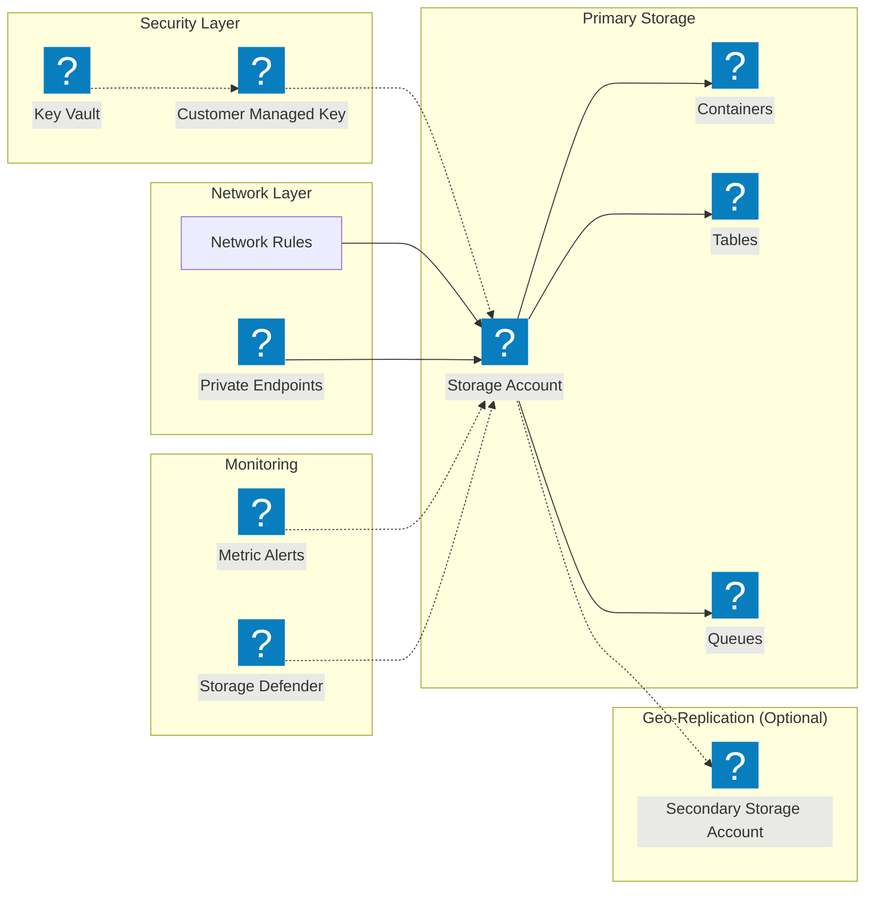

## Diagram

The following diagram illustrates the architecture and relationships between the main components of this module:

```mermaid
flowchart LR
    subgraph Security["Security Layer"]
        kv["Key Vault"]
        kv@{ icon: "azure:key-vaults"}

        cmk["Customer Managed Key"]
        cmk@{ icon: "azure:keys"}
    end

    subgraph Storage["Primary Storage"]
        sa["Storage Account"]
        sa@{ icon: "azure:storage-accounts"}

        containers["Containers"]
        tables["Tables"]
        queues["Queues"]

        containers@{ icon: "azure:storage-container" }
        queues@{ icon: "azure:storage-queue" }
        tables@{ icon: "azure:table" }

    end

    subgraph Network["Network Layer"]
        netrules["Network Rules"]

        pep["Private Endpoints"]
        pep@{ icon: "azure:private-endpoints"}
    end

    subgraph Monitoring["Monitoring"]
        alert["Metric Alerts"]
        alert@{ icon: "azure:monitor"}

        defender["Storage Defender"]
        defender@{ icon: "azure:microsoft-defender-for-cloud" }
    end

    subgraph Replication["Geo-Replication (Optional)"]
        secondary["Secondary Storage Account"]
        secondary@{ icon: "azure:storage-accounts"}
    end

    %% Dependencies
    kv -.-> cmk
    cmk -.-> sa
    netrules --> sa
    pep --> sa
    sa --> containers
    sa --> tables
    sa --> queues
    sa -.-> secondary
    alert -.-> sa
    defender -.-> sa
```
